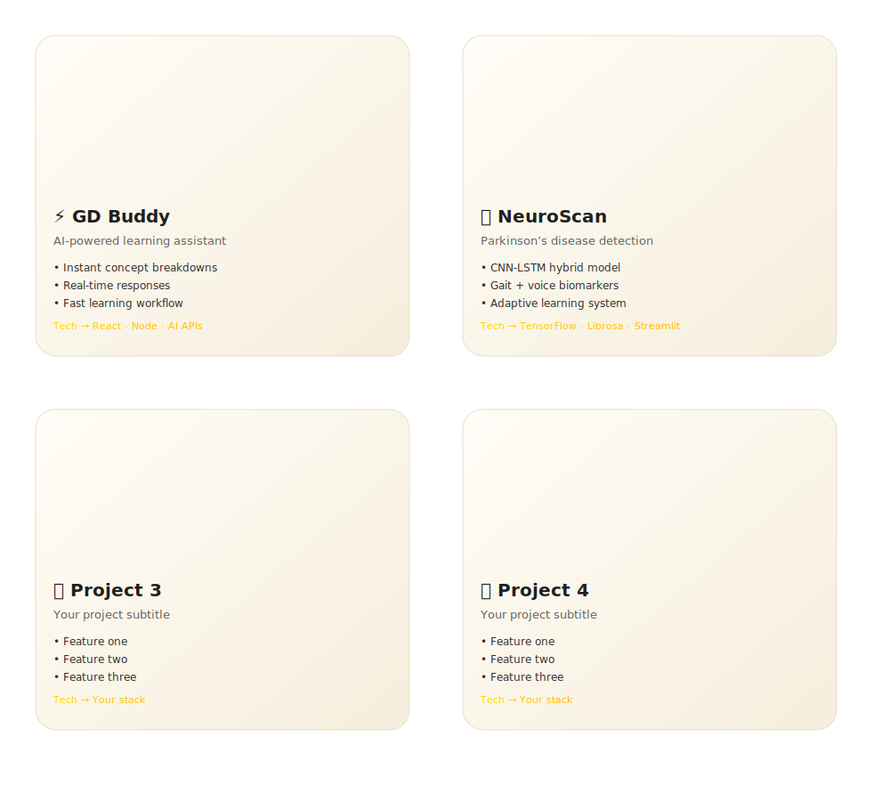

<em>Building intelligent systems with clarity, ethics, and real-world impact.</em>

  

## 👨‍🚀 About Me

I’m a **final-year Computer Science student** focused on building **intelligent, scalable, and human-centric systems** at the intersection of **AI, Web, and real-world impact**.

- **Domain**: AI • Web • Real-World Systems
- **Primary Focus**: Deep Learning for Healthcare
- **Currently Exploring**:
  - Generative AI & Large Language Models  
  - Quantum Machine Learning  
  - Neural & Human-Computer Interfaces  
> *I don’t just build software — I design systems that think, adapt, and matter.*

<h2>🧰 Techy Stuff</h2>

<table align="center">
  <tr>
    <th>💻 Languages</th>
    <th>🎨 Frontend</th>
  </tr>
  <tr>
    <td align="center">
      
    </td>
    <td align="center">
      
    </td>
  </tr>
  <tr>
    <th>⚙️ Backend & APIs</th>
    <th>🧠 AI / ML</th>
  </tr>
  <tr>
    <td align="center">
      
    </td>
    <td align="center">
      
    </td>
  </tr>
  <tr>
    <th>🗄 Databases</th>
    <th>🚀 DevOps & Tools</th>
  </tr>
  <tr>
    <td align="center">
      
    </td>
    <td align="center">
      
    </td>
  </tr>
</table>

<h2>💎 Featured Projects</h2>

## 📊 GitHub Activity Snapshot

<table align="center">
  <tr>
    <td align="center">
      
    </td>
    <td align="center">
      
    </td>
  </tr>
</table>

## 📊 GitHub Activity Snapshot

---

## 🌐 Connect With Me

---

## ✨ Philosophy

> *“The most elegant systems are built when engineering discipline meets ethical intent.”*

---

## 🚀 Open to

- Research collaborations  
- AI / ML internships & roles  
- High-impact open-source work  

**Let’s build something meaningful.**

---
