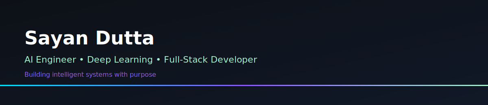
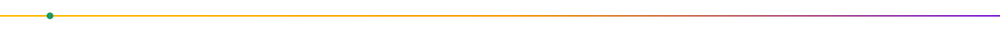
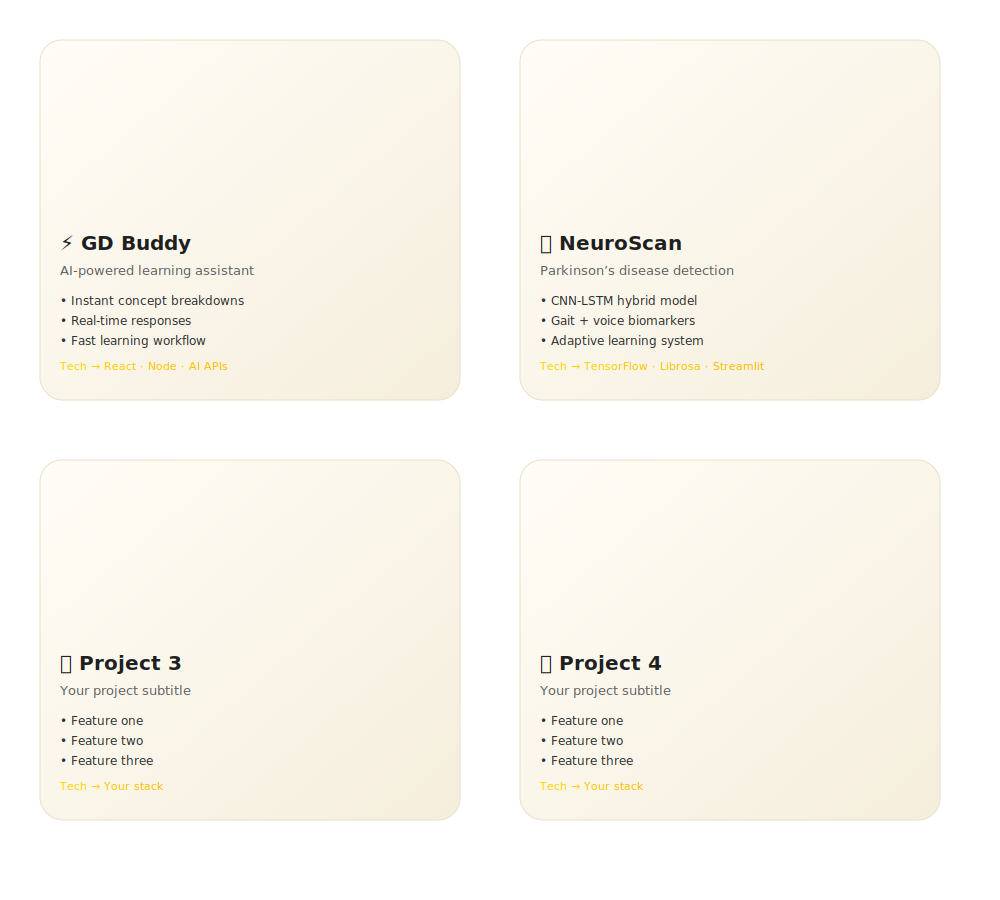
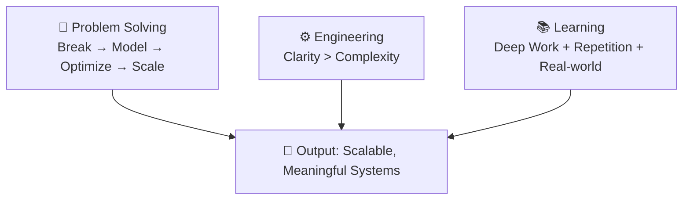
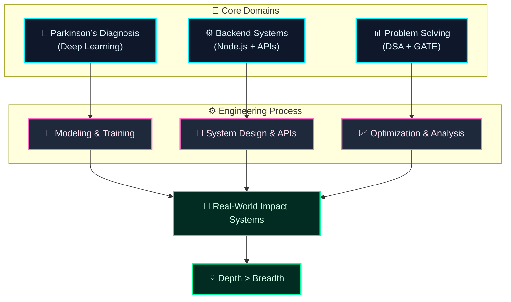

<p align="center"><em>Building intelligent systems with clarity, ethics, and real-world impact.</em></p>
<p align="center">
  
</p>



<h2 align="center">👨‍🚀 About Me</h2>
<p align="center">
  
</p>

<div align="center">

### 🧬 What Sets Me Apart

<table>
<tr>
<td align="left" width="300">

🧠 <b>AI + Systems Thinking</b>  
⚙️ <b>Real-world Deployment</b>  

</td>

<td align="left" width="300">

📈 <b>Long-term Mastery</b>  
🌍 <b>Impact-first Mindset</b>  

</td>
</tr>
</table>

<br>

<i>“I don’t chase trends. I build depth.”</i>

</div>


<div align="center">
  
### 🧩 Core Snapshot

<table>
  <tr>
    <td align="center" width="160">
      
      <br />
      <sub><b>Healthcare AI</b></sub>
    </td>
    <td align="center" width="160">
      
      <br />
      <sub><b>Scalable Systems</b></sub>
    </td>
    <td align="center" width="160">
      
      <br />
      <sub><b>DSA & Logic</b></sub>
    </td>
  </tr>
  <tr>
    <td align="center" width="160">
      
      <br />
      <sub><b>GenAI & LLMs</b></sub>
    </td>
    <td align="center" width="160">
      
      <br />
      <sub><b>Quantum & HCI</b></sub>
    </td>
    <td align="center" width="160">
      
      <br />
      <sub><b>Human-Centric UX</b></sub>
    </td>
  </tr>
</table>

</div>

<div align="center">

### ⚡ Philosophy

<br>
<!-- Glass Card -->
<div style="
  backdrop-filter: blur(12px);
  background: linear-gradient(135deg, rgba(0,245,255,0.12), rgba(255,110,199,0.12));
  border: 1px solid rgba(255,255,255,0.18);
  border-radius: 20px;
  padding: 22px;
  width: 80%;
  max-width: 650px;
">

```diff
+ Build systems, not just projects 🚀
# Think in terms of impact 🌍
- Learn deeply, execute consistently 🔥
```
</div> <br> <!-- Gradient Accent Badge -->  </div>


<h2>🧰 Techy Stuff</h2>

<table align="center">
  <tr>
    <th>💻 Languages</th>
    <th>🎨 Frontend</th>
  </tr>
  <tr>
    <td align="center">
      
    </td>
    <td align="center">
      
    </td>
  </tr>
  <tr>
    <th>⚙️ Backend & APIs</th>
    <th>🧠 AI / ML</th>
  </tr>
  <tr>
    <td align="center">
      
    </td>
    <td align="center">
      
    </td>
  </tr>
  <tr>
    <th>🗄 Databases</th>
    <th>🚀 DevOps & Tools</th>
  </tr>
  <tr>
    <td align="center">
      
    </td>
    <td align="center">
      
    </td>
  </tr>
</table>


<h2>💎 Featured Projects</h2>

<table width="1000px" style="border-collapse: collapse; border: none; border-spacing: 0; font-family: -apple-system, BlinkMacSystemFont, 'Segoe UI', Roboto, Helvetica, Arial, sans-serif;">
  <tr>
    <td width="500" style="padding: 10px; border: none; vertical-align: top;">
      <div style="background: linear-gradient(135deg, #FFFDF7 0%, #F5EEDC 100%); border: 1px solid #E8DFC8; border-radius: 22px; padding: 20px; min-height: 360px;">
        
        <div style="font-size: 20px; font-weight: 600; color: #1F1F1F; margin-bottom: 5px;">⚡ GD Buddy</div>
        <div style="font-size: 13px; color: #5F5F5F; margin-bottom: 15px;">AI-powered GD practice platform</div>
        <div style="font-size: 12px; color: #2F2F2F; line-height: 1.8; margin-bottom: 15px;">
          • AI-Based Performance Analysis<br>
          • Real-time GD Sessions<br>
          • Boost Confidence & Become Placement-Ready
        </div>
        <div style="font-size: 11px; font-weight: bold; color: #FFB800; text-transform: uppercase; letter-spacing: 0.5px;">Tech → React · Node · AI APIs</div>
      </div>
    </td>
    <td width="500" style="padding: 10px; border: none; vertical-align: top;">
      <div style="background: linear-gradient(135deg, #FFFDF7 0%, #F5EEDC 100%); border: 1px solid #E8DFC8; border-radius: 22px; padding: 20px; min-height: 360px;">
        
        <div style="font-size: 20px; font-weight: 600; color: #1F1F1F; margin-bottom: 5px;">🧠 NeuroScan</div>
        <div style="font-size: 13px; color: #5F5F5F; margin-bottom: 15px;">Parkinson’s disease detection</div>
        <div style="font-size: 12px; color: #2F2F2F; line-height: 1.8; margin-bottom: 15px;">
          • CNN-LSTM hybrid model<br>
          • Gait + voice biomarkers<br>
          • Adaptive learning system
        </div>
        <div style="font-size: 11px; font-weight: bold; color: #FFB800; text-transform: uppercase; letter-spacing: 0.5px;">Tech → TensorFlow · Librosa · Streamlit</div>
      </div>
    </td>
  </tr>
  <tr>
    <td width="500" style="padding: 10px; border: none; vertical-align: top;">
      <div style="background: linear-gradient(135deg, #FFFDF7 0%, #F5EEDC 100%); border: 1px solid #E8DFC8; border-radius: 22px; padding: 20px; min-height: 360px;">
        
        <div style="font-size: 20px; font-weight: 600; color: #1F1F1F; margin-bottom: 5px;">🌐 Project 3</div>
        <div style="font-size: 13px; color: #5F5F5F; margin-bottom: 15px;">Your project subtitle</div>
        <div style="font-size: 12px; color: #2F2F2F; line-height: 1.8; margin-bottom: 15px;">
          • Feature one<br>
          • Feature two<br>
          • Feature three
        </div>
        <div style="font-size: 11px; font-weight: bold; color: #FFB800; text-transform: uppercase; letter-spacing: 0.5px;">Tech → Your stack</div>
      </div>
    </td>
    <td width="500" style="padding: 10px; border: none; vertical-align: top;">
      <div style="background: linear-gradient(135deg, #FFFDF7 0%, #F5EEDC 100%); border: 1px solid #E8DFC8; border-radius: 22px; padding: 20px; min-height: 360px;">
        
        <div style="font-size: 20px; font-weight: 600; color: #1F1F1F; margin-bottom: 5px;">🚀 Project 4</div>
        <div style="font-size: 13px; color: #5F5F5F; margin-bottom: 15px;">Your project subtitle</div>
        <div style="font-size: 12px; color: #2F2F2F; line-height: 1.8; margin-bottom: 15px;">
          • Feature one<br>
          • Feature two<br>
          • Feature three
        </div>
        <div style="font-size: 11px; font-weight: bold; color: #FFB800; text-transform: uppercase; letter-spacing: 0.5px;">Tech → Your stack</div>
      </div>
    </td>
  </tr>
</table>





## 🧠 How I Think

```yaml
problem_solving:
  approach: "Break → Model → Optimize → Scale"

engineering:
  priority: "Clarity > Complexity"

learning:
  method: "Deep work + repetition + real-world application"
```

```mermaid
flowchart TD
    A["🧩 Problem Solving<br/>Break → Model → Optimize → Scale"]
    B["⚙️ Engineering<br/>Clarity > Complexity"]
    C["📚 Learning<br/>Deep Work + Repetition + Real-world"]

    A --> D["🚀 Output: Scalable, Meaningful Systems"]
    B --> D
    C --> D
```


## 🧪 Proof of Work


```mermaid
flowchart TD

    %% ===== INPUT LAYER =====
    subgraph L1["🧩 Core Domains"]
        A["🧠 Parkinson’s Diagnosis<br/>(Deep Learning)"]
        B["⚙️ Backend Systems<br/>(Node.js + APIs)"]
        C["📊 Problem Solving<br/>(DSA + GATE)"]
    end

    %% ===== PROCESS LAYER =====
    subgraph L2["⚙️ Engineering Process"]
        D["🧠 Modeling & Training"]
        E["🔗 System Design & APIs"]
        F["📈 Optimization & Analysis"]
    end

    %% ===== OUTPUT =====
    G["🚀 Real-World Impact Systems"]
    H["💡 Depth > Breadth"]

    %% ===== FLOW =====
    A --> D
    B --> E
    C --> F

    D --> G
    E --> G
    F --> G

    G --> H

    %% ===== STYLING =====
    classDef core fill:#0f172a,stroke:#00f5ff,stroke-width:2px,color:#e0f7ff;
    classDef process fill:#1e293b,stroke:#ff6ec7,stroke-width:2px,color:#ffe4f3;
    classDef output fill:#022c22,stroke:#00ff9c,stroke-width:2px,color:#d1ffe9;

    class A,B,C core;
    class D,E,F process;
    class G,H output;
```


## 📊 GitHub Activity Snapshot


## 🌐 Connect With Me

[](mailto:duttasayan947595@gmail.com)
[](https://www.linkedin.com/in/duttasayan835)
[](https://github.com/ObsyanX)


## ✨ Philosophy

> *“The most elegant systems are built when engineering discipline meets ethical intent.”*


## 🚀 Open to

- Research collaborations  
- AI / ML internships & roles  
- High-impact open-source work  

**Let’s build something meaningful.**

---
