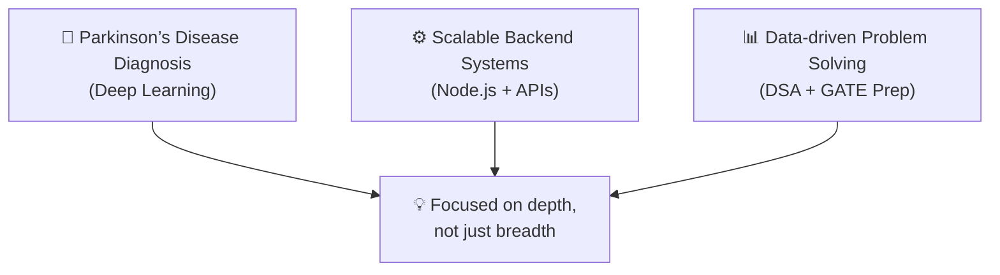

<p align="center"><em>Building intelligent systems with clarity, ethics, and real-world impact.</em></p>
<p align="center">
  
</p>


<h2 align="center">👨‍🚀 About Me</h2>
<p align="center">
  
</p>


<div align="center">
### 🧬 What Sets Me Apart

- 🧠 I combine **AI + Systems Thinking**, not just model building  
- ⚙️ I focus on **real-world deployment**, not only experiments  
- 📈 I optimize for **long-term mastery (GATE + fundamentals)**  
- 🌍 I build with **impact-first mindset (Healthcare AI)**  

> *I don’t chase trends. I build depth.*


<div align="center">
  
## 🧩 Core Snapshot

<table>
  <tr>
    <td align="center" width="160">
      
      <br />
      <sub><b>Healthcare AI</b></sub>
    </td>
    <td align="center" width="160">
      
      <br />
      <sub><b>Scalable Systems</b></sub>
    </td>
    <td align="center" width="160">
      
      <br />
      <sub><b>DSA & Logic</b></sub>
    </td>
  </tr>
  <tr>
    <td align="center" width="160">
      
      <br />
      <sub><b>GenAI & LLMs</b></sub>
    </td>
    <td align="center" width="160">
      
      <br />
      <sub><b>Quantum & HCI</b></sub>
    </td>
    <td align="center" width="160">
      
      <br />
      <sub><b>Human-Centric UX</b></sub>
    </td>
  </tr>
</table>

</div>


<div align="center">

### ⚡ Philosophy

<br>
<!-- Glass Card -->
<div style="
  backdrop-filter: blur(12px);
  background: linear-gradient(135deg, rgba(0,245,255,0.12), rgba(255,110,199,0.12));
  border: 1px solid rgba(255,255,255,0.18);
  border-radius: 20px;
  padding: 22px;
  width: 80%;
  max-width: 650px;
">

```diff
+ Build systems, not just projects 🚀
# Think in terms of impact 🌍
- Learn deeply, execute consistently 🔥
```
</div> <br> <!-- Gradient Accent Badge -->  </div>


<h2>🧰 Techy Stuff</h2>

<table align="center">
  <tr>
    <th>💻 Languages</th>
    <th>🎨 Frontend</th>
  </tr>
  <tr>
    <td align="center">
      
    </td>
    <td align="center">
      
    </td>
  </tr>
  <tr>
    <th>⚙️ Backend & APIs</th>
    <th>🧠 AI / ML</th>
  </tr>
  <tr>
    <td align="center">
      
    </td>
    <td align="center">
      
    </td>
  </tr>
  <tr>
    <th>🗄 Databases</th>
    <th>🚀 DevOps & Tools</th>
  </tr>
  <tr>
    <td align="center">
      
    </td>
    <td align="center">
      
    </td>
  </tr>
</table>


<h2>💎 Featured Projects</h2>


## 🧪 Proof of Work


```mermaid
flowchart TD
    A["🧠 Parkinson’s Disease Diagnosis<br/>(Deep Learning)"]
    B["⚙️ Scalable Backend Systems<br/>(Node.js + APIs)"]
    C["📊 Data-driven Problem Solving<br/>(DSA + GATE Prep)"]
    D["💡 Focused on depth,<br/>not just breadth"]

    A --> D
    B --> D
    C --> D
```


## 📊 GitHub Activity Snapshot


## 🌐 Connect With Me

[](mailto:duttasayan947595@gmail.com)
[](https://www.linkedin.com/in/duttasayan835)
[](https://github.com/ObsyanX)


## ✨ Philosophy

> *“The most elegant systems are built when engineering discipline meets ethical intent.”*


## 🚀 Open to

- Research collaborations  
- AI / ML internships & roles  
- High-impact open-source work  

**Let’s build something meaningful.**

---
